# Piazza API

## About

A RESTful social media SaaS called Piazza. In Piazza, users post messages for a particular topic while others browse posts and perform basic interactions, including liking, disliking, or adding a comment.
This is a courswork project for the Cloud Computing module at Birkbeck, University of London.

### Getting started

Install node and yarn or npm on your computer.
Create a .env file and populate it with the database connector string that you can retrieve from Mongodb Atlas and with a secret string for the JWT functionality:

```
MONGODB_URI=<DB connector string>
JWT_SECRET=<Some random string>
```

The Topic documents have to be created manually, the rest can be created via the API. Run `yarn dev` or `npm run dev` to start the development server. The entry point for the application is the app.js file. After starting, the app tries to connect to the database and should log `[nodemon] starting `node app.js`
Connecting to DB
Connected to DB`.

## Setup

### Development Setup

The project uses `yarn` as package manager, `prettier` as formatter, `eslint` as linter and `nodemon` to run the development server and track changes during development. These are all listed as 'devdependencies' in the package.json file. I am used to have these helpers in my projects and combined with the VSCode settings, they help me to focus on the logic of the code.

### Project Setup

The Api is a Node.js application that uses the Express framework. The docker container that will be deployed to the virtual server in the cloud will have Node installed. This means Node will run the app on the virual server. During development, however, Nodemon is used, hence it is a developent dependency. I set the the eslint config on purpose so that I can use modules, as we use a modern node version and all the dependencies used in the project are compatible.

## Phase A

### App Directory Structure

All the logic is in the `App` directory. This helps to create a more maintainable and scalable structure for the app. As suggested in [this article](https://dev.to/mr_ali3n/folder-structure-for-nodejs-expressjs-project-435l) the directory is called `App` and instead of `Src` because the files run on the server and will not be compiled, transpiled, and minified to be sent to the client.
The routes forward the request to their corresponding controllers, which will then send the response. This is a good practice shown in the [Mozilla Express Tutorial](https://developer.mozilla.org/en-US/docs/Learn/Server-side/Express_Nodejs/routes#overview)
Adding the `App` directory as 'imports' alias in the `package.json`, makes it easy to import functions from the right place.  
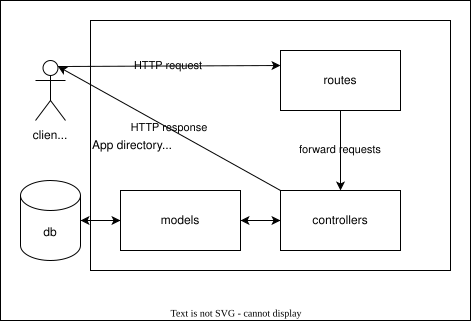

### Infrastructure Setup Description

The app is containerized as described in [the docker docs](https://docs.docker.com/get-started/workshop/02_our_app/). The only thing that needs to be adjusted is on line 7: the app.js sits in the root directory and is not called index.js.

[Docker Build Cloud is used in CI (continuous integration)](https://docs.docker.com/build-cloud/ci/). For this, the docker username must be added as environment variable in the GitHub Repository. And a Personal Access Token (PAT) needs to be added as secret.
GitHub Actions secrets and variables:  
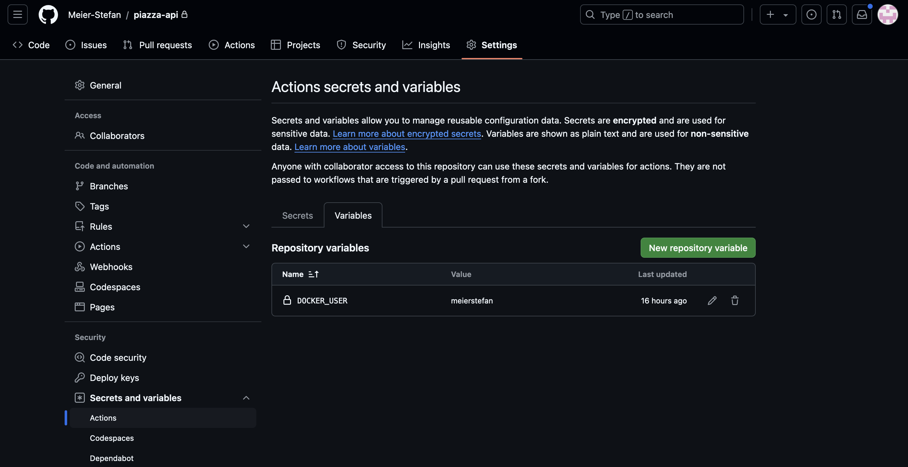  
The docker manual triggers on push to the main branch, but I decided to use the manual workflow_dispatch event trigger instead.
In the docker build cloud, a cloud builder needs to be added, I added one and called it `piazza-builder`.
GitHub Actions let the docker cloud build the image:  
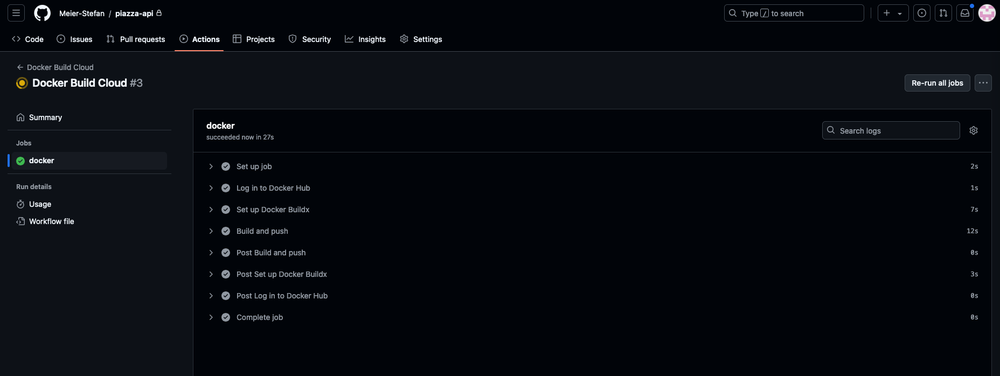  
Docker Build Cloud is fast, but it costs to build. They gave me 60 free minutes because I implemented CI from Github Actions, thanks Docker. Build minutes overview:  
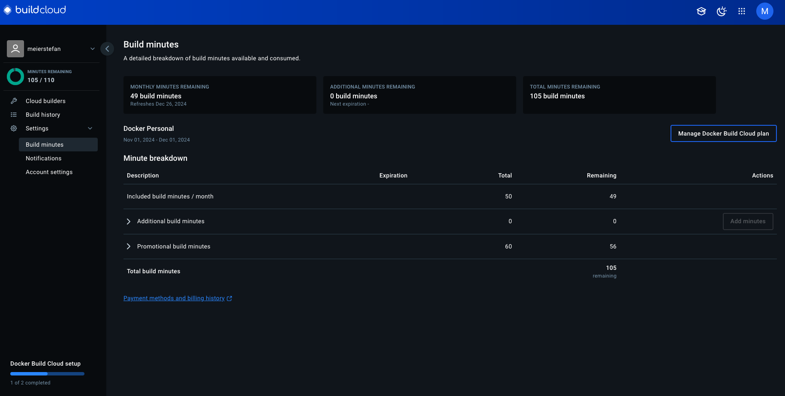  
As a result, the image was available on Docker Hub:
  
To make the REST API endpoints available in the virtual machine, Docker was installed on the virtual machine and the docker-user was created like in [lab 5.1](https://github.com/warestack/cc/blob/master/Class-5/Lab5.1%20Introduction%20to%20Docker.md). [Video of lab 5.1](https://github.com/warestack/cc/blob/master/Class-5/Lab5.1%20Introduction%20to%20Docker.md)
The docker-user was logged in on docker hub using the PAT method from above. Then the docker container was started with port mapping like shown in lab 5.1. Because the image was only in the docker cloud, it was automatically pulled before the container was started:  
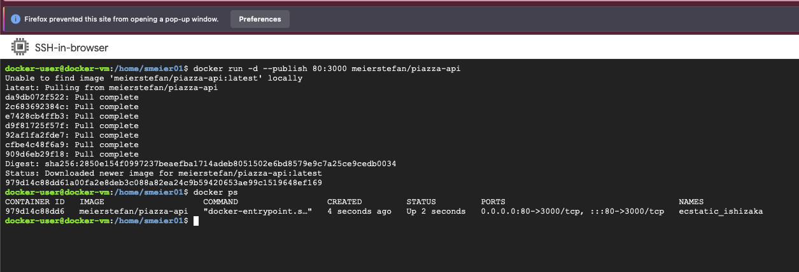  
Once the container was up and running, the endpoints were available under the virtual machine IP address. The following screenshots show the Home page, post list endpoint, topic detail, topic list and user profile endpoints:

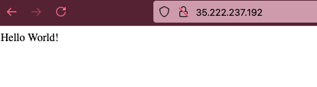  
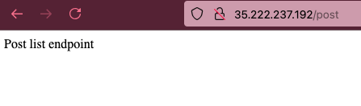  
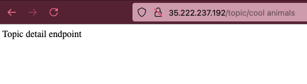  
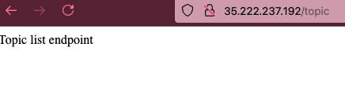  
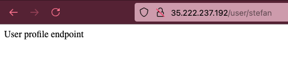

## Phase B

### Connecting to the database

To start the development server, the node environment is specified in the 'dev' script in the package.json file. So the app knows from which .env dotfile to take the environment variables.
The main function currently only connects to the database using the `connect` function from mongoose and console logs when it started and if it worked.

### Register a user

When a user posts to the `user/register` endpoint, route will forward to the corresponding controller. That controller uses a validation function to make sure that the input makes sense and is secure. The validation function is built with the `string, required, min, max` and `email` functions from the `joi` library.

> **IDEA:** For this purpose, the functions were used in a simple way, but the [joi api reference](https://joi.dev/api/?v=17.13.3#stringemailoptions) documents ways how this could be improved.

Using the `bcryptjs` library, the password is hashed and 5 rounds of salt are used before it gets stored in the database.

### Login as user

When a user posts to the `user/login` endpoint, there is, additional to the validation with `joi`, the password gets compared with a function from `bycryptjs` and, if the password matches, the response contains a json web token, that can later be used to access resources that require authentication.

The `jsonwebtoken` library creates that token using a secret variable from the .env dotfile.

> **SPECIAL:** The json web token expires after one hour and contains the [user ID as payload](https://www.npmjs.com/package/jsonwebtoken). This user Id can for example be used by the controllers to make sure that one user does not modify the profile of another user.

> **IDEA:** It would be useful if the token would refresh.

### Interact with an endpoint that requires authentication

To keep the repository clean and organised, a middleware folder is used like suggested by [this turorial.](https://dev.to/taiwo17/nodejs-authentication-and-authorization-with-jwt-building-a-secure-web-application-236f#set-up-file-structure) The routes that require use the `isAuthenticated` middleware function to make sure that the user is logged in and allowed to proceed. Logged in means that the request headers contain a key value pair of a key containing `auth-token` and a value containing the json web token.If the user is not logged in, or has a wrong json web token, `isAuthenticated` will send the corresponding response instead of letting the route forwarding the request to the controller.

## Phase C

### Models

The Models are created so that they are practical to use in this small project.

As Joe Karlsson from mongodb explains in [this video,](https://www.youtube.com/watch?v=QAqK-R9HUhc) it is a good idea to think about what will be displayed when designing the database schema. I tied to follow this advice, but also, I did try not to over optimise as if this app was serving millions of users already.

There are 3 Models:  
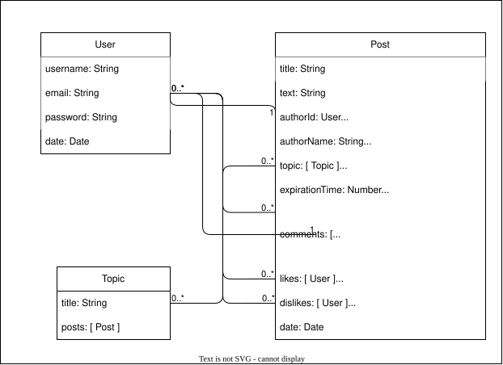
The above diagram follows the style of [the Mozilla tutorial](https://developer.mozilla.org/en-US/docs/Learn/Server-side/Express_Nodejs/mongoose#designing_the_locallibrary_models) that also uses mongoose. This means that the multiplicities are represented by the numbers on the diagram. The maximum and minimum of each model that may be present in the relationship are at the corresponding end of the connection line. An asterisk (\*) means that there is theoretically no maximum. Practically, as mentioned above, my implementation can reach the 16MB document limit of MongoDB.

`Users` can create zero or many `Posts`, `Comments`, `Likes`, and `Dislikes`. Each `Post` and each `Comment` have one `User` as author. `Likes` and `Dislikes` are arrays that can have zero or many `Users` listed. Each `Post` must have at least one `Topic`, but a `Topic` has zero or many `Posts`.

#### Post

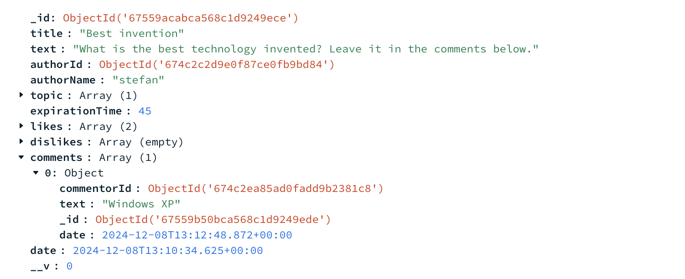  
The comments are and array of documents in the post documents for now. This is how it will be displayed.

Reactions and comments conatain the link to the user like this: `likes: [{ type: Schema.Types.ObjectId, ref: "users" }],`

> **IDEA:** For projects that could have milions of users, it would make sense to store the comments in separate collections and also to track likes in documents that store which user liked/disliked which post. Both of the above will help to avoid problems with the 16mb document limit and improve the query speed.

#### Topic

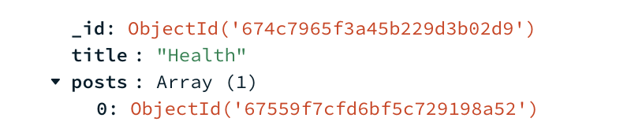  
The topic is simple, it just contains a title and an array of posts. However, currently I don't use that array. If I display the posts of a topic, I use the post list controller and filter fo the topic id.

> **IDEA:** The likes and dislikes are arrays of userIds. This can be displayed as number in the frontend. The user can then click/hover on these reaction numbers to see who reacted. Also, the creation date could be made human readable like the time to expiration in the `showIfActive` function.

#### User

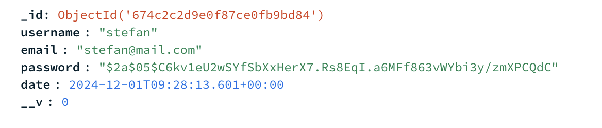  
The username is not unique, so there could be more than one user with the same name, but for linking, the user ID is stored. Like this, buttons like `reply in direct message` or so, will still work.

### Reactions and comments

The reactions and comments on posts can only be done from the post detail endpoint. The frontend can call that from the list view and only update the affected post though.

### Filter and Sort

With this solution, the database stores the arrays and if the user wants to sort by interest, the app has to count and sort.

Similarily the status 'active' is calculated by the app with the help of database values and the local time of the client.

Because both of the above modify the posts that are displayed and can be filtered or sorted, the logic gets a bit messy. One sort or filter is done locally and based on that, the rest is sent to the database to handle.

> **IDEA:** The limit of posts fetched is set to 15, which is a good number of posts to show per page. The frontend pagination logic will trigger fetcing the next 15 if the user paginates.

### API reference

`/`:  
The welcome page. Responds with 'please log in' or if logged in, 'hello, [username]'.

#### Endpoints that can be accessed if authorised:

GET `post/`:  
List of posts. Responds with an array of Post objects. Can be used with `filters` or `sort`, that are passed in the request body as follows:
`{filters:[options]}`  
options include:  
`active`: type: Boolean `false|true `  
`topic`: type: [Schema.Types.ObjectId](https://mongoosejs.com/docs/schematypes.html#objectids) `"topicId"`  
`authorId`: type: [Schema.Types.ObjectId](https://mongoosejs.com/docs/schematypes.html#objectids) `"topicId"`

POST `post/new`:  
Create a new post. Responds with the newly created post object.
The new post is passed in the request body in the following format:

```
  title: { type: String, required: true, min: 3, max: 256 },
  text: { type: String, required: true, min: 3, max: 2048 },
  topicId: [{ type: Schema.Types.ObjectId, required: true, ref: "topics" }],
  expirationTime: { type: Number, required: true, min: 5 },
```

example:  
`{"title":"Question",
 "text":"What is the coolest animal?",
 "expirationTime":"8",
 "topicId": "674c7965f3a45b229d3b02d9"}`

GET `post/:id`:  
Detail view of a post.

POST `post/:id/comment`:  
Accepts new comments for posts if they are still active. The comments are passed in the request body in the following format:

```
{ text: { type: String, required: true, min: 3, max: 1024 }}
```

POST `post/:id/react`:  
Accepts new reactions for posts if they are still active. Reactions are passed in the request body in the following format:

```
{ reaction: [options]}
```

The options are one of the two following strings: `"likes"` or `"dislikes"`

GET `topic/`:  
List of all the topics. Still needs to be implemented. Curretnly responds with the string "Topic list endpoint"

GET `topic/:id`:  
Detail view of a topic. Responds with a list of post that belong to the topic. Accepts the same request body options as `post/`.

POST `user/login`:  
Login page. Responds with a json web token. This is implented in that way that it is easy to test/review. Accepts the following request body:

```
{email: { type: String, required: true, min: 3, max: 256 },
password: { type: String, required: true, min: 3, max: 1024 },}
```

example:

```
{"email":"user@mail.com",
"password":"TQVm4cBK"}
```

POST `user/registration`:
Registration page. Responds with the new created user object. Accepts the following request body:

```
 username: { type: String, required: true, min: 3, max: 256 },
  email: { type: String, required: true, min: 3, max: 256 },
  password: { type: String, required: true, min: 3, max: 1024 }
```

example:

```
{"username":"user",
"email":"user@mail.com",
"password":"TQVm4cBK"}
```

GET `user/:id`  
User detail page. Still needs to be implemented. Curretnly responds with the string "User profile endpoint".

## Phase D

To test the application, the app was deployed in the google cloud virtual machine and then tested manually. The test report can be found in the `TestCases.md` file.

## Phase E

For the testing, the app was deployed into a google cloud virtual machine with almost the same method as described above in Phase A:
From my local, I push code to Github, and there I manually trigger a Github Action, that lets the docker cloud build the image. After that, the image is pulled from the cloud VM, that has Docker installed and a docker user set up. The only differenct to Phase A is, that now there is an app deployed that needs to handle tokens and connect to the database. As I am not pushing the .env file to github, the secrets must be provided differently:
To provide the env variables needed, I passed them to the Docker container using the --env flag:
`docker run --env MONGODB_URI"<the actual string>" --env JWT_SECRET="<the actual secret>" -p 80:3000 meierstefan/piazza-api`
There are better ways, but for this one time deployment it is fine like this.

## Phase F

### 5 Replicas

In kubernetes, secrets can not simply be passed as env variables, because there are multiple containers and maybe we will add more later. To provide the secret in the simplest way, I created Kubernetes secrets as follows:

```
kubectl create secret generic database-connection \
--from-literal=MONGODB_URI='<actual string that the mongodb dashboard provides>'

kubectl create secret generic json-web-token-secret \
--from-literal=JWT_SECRET='<actual secret>'
```

Then everything was ready and the fife nodes could be started like we learned [in class](https://github.com/warestack/cc/tree/master/Class-6). First the deployment yaml file is created with `vim` directly in the google cloud console.

```
apiVersion: apps/v1
kind: Deployment
metadata:
  name: piazza-api-deployment
  labels:
    app: piazza-api
spec:
  replicas: 5
  selector:
    matchLabels:
      app: piazza-api
  template:
    metadata:
      labels:
        app: piazza-api
    spec:
      containers:
      - name: piazza-api
        image: meierstefan/piazza-api:latest
        imagePullPolicy: Always
        ports:
        - containerPort: 3000
        envFrom:
        - secretRef:
            name: json-web-token-secret
        - secretRef:
            name: database-connection
```

The simple steps are explained one by one in [this article](https://spacelift.io/blog/kubernetes-deployment-yaml). Interesting is the `imagePullPolicy`: [Here](https://kubernetes.io/docs/concepts/containers/images/) the kubernetes docs explain what is going on. We have set it so `Always`, which means that everytime a new container is launched, kubernetes checks, if there is a new image in the docker registry. If there is a new one, it pulls it to the virtual machine. But if the one in the cache is the exactly same already, it does not pull the image because it can use the cache.

To start the replicas, we tell `kubectl` to apply the file.  


To make sure that they are alive, we tell it to get the pods.  
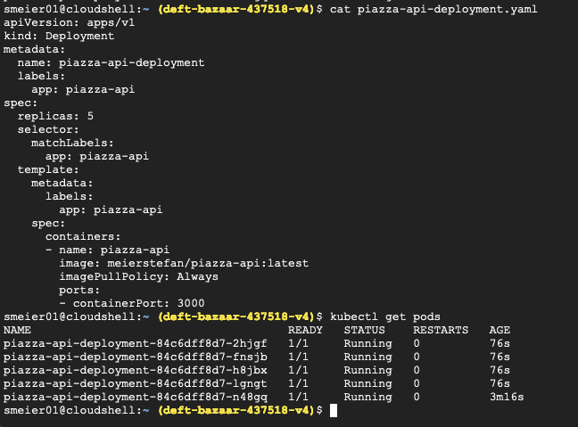

> **IDEA:** To make the setup easier, it would be a good idea to put the secrets into the [secret-manager](https://cloud.google.com/security/products/secret-manager) and then they could be accessed from terraform. Then, it is no longer neccesary to manually start the pods with `kubectl`.

### Loadbalancer

With the load balancer, we make the pods accessible. Like above, we need this file first:

```
apiVersion: v1
kind: Service
metadata:
  name: piazza-api-service
  labels:
    app: piazza-api-service
spec:
  type: LoadBalancer
  ports:
  - name: http
    port: 80
    protocol: TCP
    targetPort: 3000
  selector:
    app: piazza-api
  sessionAffinity: None
```

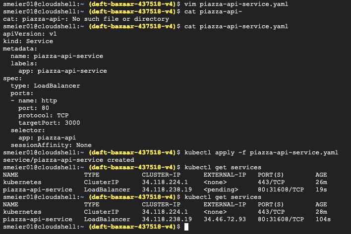

[The docs](https://kubernetes.io/docs/concepts/services-networking/service/#loadbalancer) explain that kubernetes does not have a load balancer, but by setting the `type` of this service to `Loadbalancer`, we will use the google cloud default load balancer. We set `sessionAffinity` to `None` because it does not matter if the request of the client is always passed to the same pod.
